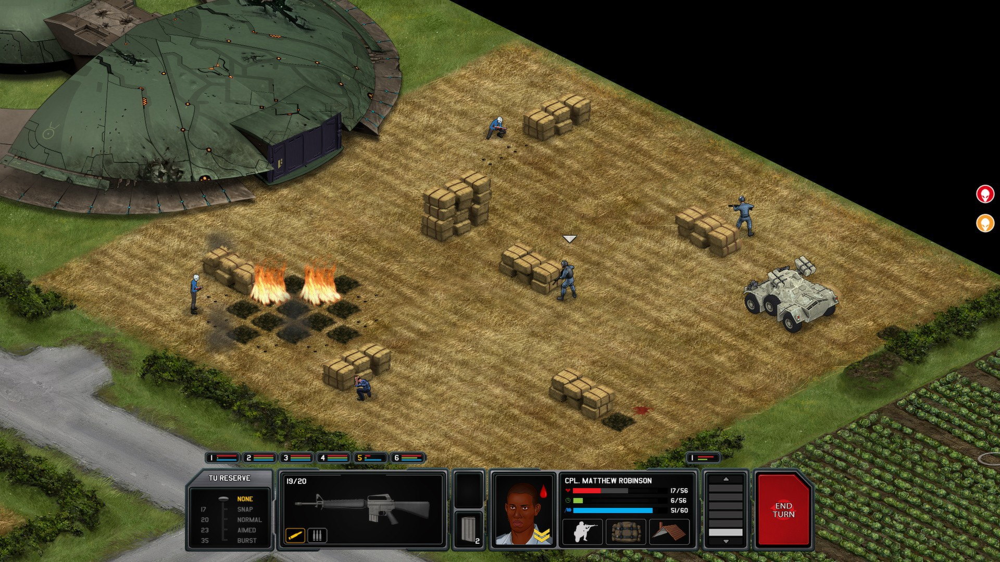
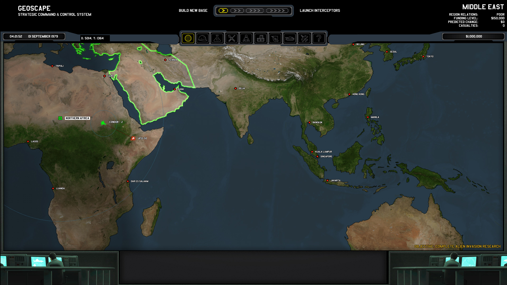


Xenonauts is a strategy game in which you control a multi-national military organisation defending a Cold War-era Earth from alien invasion, using small squads of persistent soldiers to eliminate the extraterrestrials and recover their technology in turn-based ground combat.


## System Requirements
- Processor: Intel 2 GHz
- Memory: 1 GB RAM
- Graphics: Integrated Graphics

## Repack Features
- Languages: English\*

_(\*languages with full audio support)_

- Play without extracting, highly efficient usage of space.
- NON-LAN network activity of the game blocked by default, no data sent back to any third party.

## Download


## Screenshots

